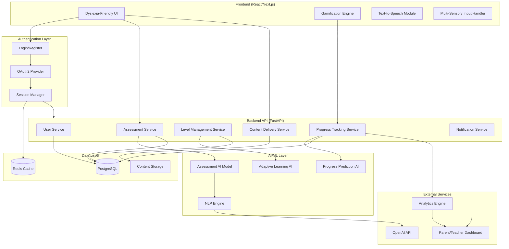
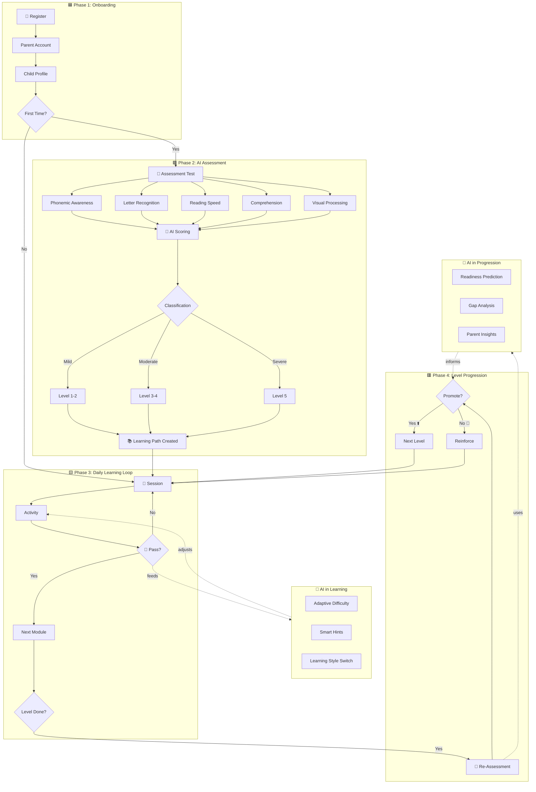
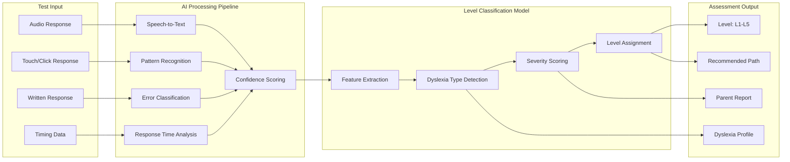
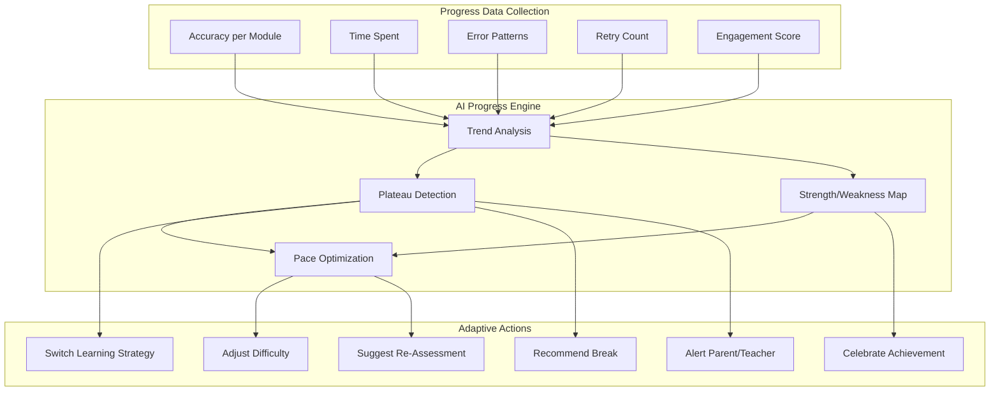
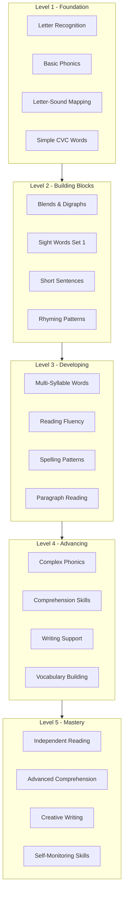
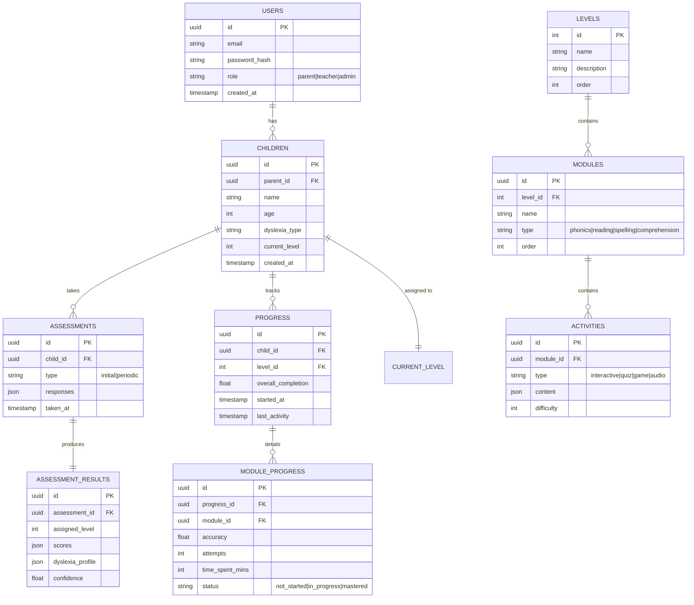
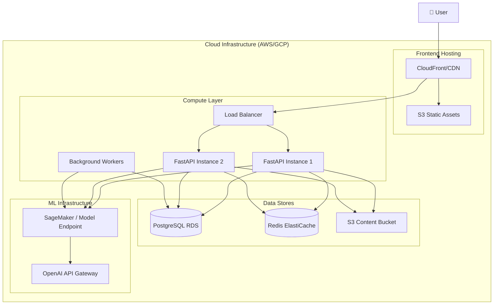

# Dyslexia Learning Platform - Architecture & Flow

## High-Level System Architecture

## User Journey Flow (Connected Phases)

## Assessment Engine Detail

## Progress Tracking & Adaptive AI

## Level & Module Structure

## Database Schema Overview

## Deployment Architecture

